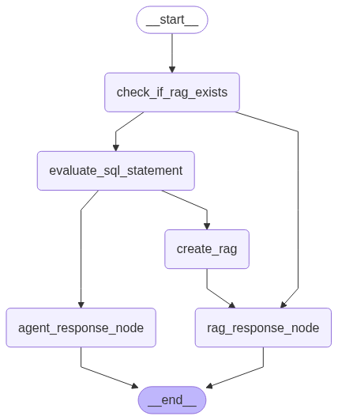

# Projekt TEG - Eksplorator Transakcji z GraphRAG

## 🚀 Przegląd

TEG (Transaction Explorer with GraphRAG) to zaawansowany asystent finansowy AI, który łączy inteligentną analizę transakcji z zaawansowanymi możliwościami RAG (Retrieval-Augmented Generation). System wykorzystuje dynamiczne podejmowanie decyzji oparte na grafach, aby dostarczać spersonalizowane wglądy finansowe i porady oparte na danych transakcyjnych.



*System automatycznie wybiera między lekkimi zapytaniami SQL a kompleksową analizą RAG na podstawie złożoności zapytania*

## 🏗️ Architektura

TEG wykorzystuje architekturę mikrousług z trzema głównymi komponentami:

### 🤖 Serwis AI (`ai/`)
- **Dynamiczny RAG oparty na LangGraph**: Inteligentne kierowanie zapytań na podstawie analizy złożoności
- **Agent SQL**: Bezpośrednie zapytania do bazy danych dla prostych pytań transakcyjnych
- **Adaptacyjny RAG**: Zaawansowane wyszukiwanie dla złożonych zapytań analitycznych
- **Integracja z OpenAI**: GPT-4o-mini do przetwarzania języka naturalnego
- **Magazyn Wektorów FAISS**: Wydajne wyszukiwanie semantyczne

### 🌐 Serwis Backend (`backend/`)
- **API REST Flask**: Czyste interfejs API dla komunikacji z frontendem
- **Zarządzanie Konwersacjami**: Historia czatu oparta na sesjach z SQLite
- **Integracja z Serwisem AI**: Bezproblemowa komunikacja z serwisem AI
- **Trwałość Danych**: Automatyczne logowanie i pobieranie konwersacji

### 🎨 Serwis Frontend (`frontend/`)
- **Interfejs Streamlit**: Nowoczesny, responsywny interfejs webowy
- **Czat w Czasie Rzeczywistym**: Interaktywny interfejs konwersacyjny
- **Zarządzanie Sesjami**: Przeglądanie poprzednich konwersacji i tworzenie nowych sesji
- **Obsługa Wielu Sesji**: Przełączanie między różnymi kontekstami konwersacji

## 🔄 Przepływ Dynamicznego Grafu

System wykorzystuje inteligentny graf decyzyjny, który:

1. **Ocenia Złożoność Zapytania**: Określa, czy zapytanie wymaga prostego SQL czy złożonej analizy
2. **Kieruje Odpowiednio**: 
   - Lekkie zapytania → Bezpośredni Agent SQL
   - Ciężkie zapytania → Tworzy instancję RAG → Zaawansowane wyszukiwanie
3. **Optymalizuje Wydajność**: Unika niepotrzebnych obliczeń dla prostych żądań
4. **Zachowuje Kontekst**: Przechowuje stan sesji między interakcjami

## ✨ Kluczowe Funkcje

- **🧠 Inteligentne Kierowanie Zapytań**: Automatyczny wybór optymalnej strategii przetwarzania
- **💬 Interfejs Konwersacyjny**: Interakcja w języku naturalnym z danymi finansowymi
- **🔍 Wyszukiwanie Semantyczne**: Znajdowanie odpowiednich transakcji w języku naturalnym
- **💾 Zarządzanie Sesjami**: Zapisywanie i ponowne odwiedzanie poprzednich konwersacji
- **🏗️ Projekt Mikrousług**: Skalowalna i łatwa w utrzymaniu architektura

## 🛠️ Stos Technologiczny

### AI i ML
- **LangChain**: Framework dla aplikacji LLM
- **LangGraph**: Orkiestracja przepływów pracy opartych na grafach
- **OpenAI GPT-4o-mini**: Model językowy do przetwarzania języka naturalnego
- **FAISS**: Wyszukiwanie podobieństwa wektorowego
- **SQLite**: Przechowywanie danych transakcyjnych

### Backend
- **Flask**: Framework webowy Python
- **SQLite**: Trwałość konwersacji
- **Requests**: Klient HTTP do komunikacji między serwisami

### Frontend
- **Streamlit**: Framework interaktywnych aplikacji webowych
- **Python**: Podstawowa logika aplikacji

### Infrastruktura
- **Docker**: Konteneryzacja wszystkich serwisów
- **Docker Compose**: Orkiestracja wielu serwisów
- **uv**: Szybkie zarządzanie pakietami Python

## 🚀 Szybki Start

### Wymagania
- Python 3.11+
- Menedżer pakietów uv
- Klucz API OpenAI
- Docker (opcjonalnie, do wdrożenia kontenerowego)

### 🔧 Główny Orkiestrator (`main.py`)

Projekt wykorzystuje zaawansowany orkiestrator, który:

- **🔄 Inteligentne Uruchamianie**: Automatyczne kolejne uruchamianie AI → Backend → Frontend
- **📊 Monitoring Logów**: Wszystkie logi z subprocessów przekierowywane do głównego systemu logowania
- **🛡️ Graceful Shutdown**: Kontrolowane zatrzymywanie wszystkich serwisów przez Ctrl+C
- **🌍 Zmienne Środowiskowe**: Automatyczne ustawianie PYTHONPATH i portów dla każdego serwisu
- **⚠️ Obsługa Błędów**: Szczegółowe raportowanie błędów uruchamiania
- **🔍 Health Monitoring**: Sprawdzanie czy procesy nadal działają co 5 sekund

### 1. Klonowanie i Konfiguracja
```bash
git clone <url-repozytorium>
cd TEG-project

# Skopiuj przykładowe pliki konfiguracyjne
cp config/.env.example config/.env
cp ai/config/.env.example ai/config/.env
cp backend/config/.env.example backend/config/.env
cp frontend/config/.env.example frontend/config/.env

# Edytuj pliki .env swoimi kluczami API i konfiguracją
# Głównie OPENAI_API_KEY w config/.env
```

### 2. Rozwój Lokalny
```bash
# Uruchom wszystkie serwisy
python main.py

# Logi będą wyświetlane w terminalu z prefiksami:
# AI: [logi z serwisu AI]
# Backend: [logi z serwisu Backend] 
# Frontend: [logi z serwisu Frontend]

# Zatrzymaj wszystkie serwisy: Ctrl+C
```

### 3. Wdrożenie Docker
```bash
# Zbuduj i uruchom wszystkie serwisy
docker-compose up -d

# Zobacz logi
docker-compose logs -f

# Zatrzymaj serwisy
docker-compose down
```

**Porty Docker:**
- **AI Service**: localhost:50000 → kontener:5001
- **Backend Service**: localhost:50001 → kontener:5000  
- **Frontend Service**: localhost:50002 → kontener:8501

*Porty można konfigurować w `config/.env`*

## 📁 Struktura Projektu

```
TEG-project/
├── main.py                 # Orkiestrator projektu
├── dynamic_rag_graph.png  # Wizualizacja przepływu grafu
├── docker-compose.yml     # Orkiestracja wielu serwisów
├── all_transactions.db    # Przykładowa baza danych transakcji
├── pyproject.toml         # Konfiguracja workspace Python
├── uv.lock               # Lock file dependencies
│
├── config/               # 🔧 Konfiguracja głównego projektu
│   ├── __init__.py      # Pakiet Python
│   ├── config_manager.py # Manager konfiguracji projektu
│   ├── project_config.json # Konfiguracja JSON głównego projektu
│   ├── .env             # Zmienne środowiskowe projektu
│   ├── .env.example     # Przykład konfiguracji środowiskowej
│   └── logging/         # 📝 System logowania
│       ├── __init__.py  # Pakiet Python
│       └── simple_logging.py # Scentralizowany system logowania
│
├── ai/                  # 🤖 Serwis AI
│   ├── app.py          # Serwis AI Flask
│   ├── config/         # Konfiguracja AI
│   │   ├── __init__.py
│   │   ├── config_manager.py
│   │   ├── ai_config.json
│   │   ├── .env
│   │   ├── .env.example
│   │   └── logging/    # 📝 System logowania AI
│   │       ├── __init__.py
│   │       └── simple_logging.py
│   ├── src/
│   │   ├── agents/     # Agenci SQL i ewaluacyjni
│   │   ├── graphs/     # Implementacja LangGraph
│   │   └── rags/       # Konfiguracje RAG
│   ├── pyproject.toml
│   └── Dockerfile
│
├── backend/            # 🌐 Serwis Backend
│   ├── app.py         # API backend Flask
│   ├── config/        # Konfiguracja Backend
│   │   ├── __init__.py
│   │   ├── config_manager.py
│   │   ├── backend_config.json
│   │   ├── .env
│   │   ├── .env.example
│   │   └── logging/   # 📝 System logowania Backend
│   │       ├── __init__.py
│   │       └── simple_logging.py
│   ├── src/
│   │   ├── database.py # Zarządzanie konwersacjami
│   │   └── call_ai_service.py # Klient serwisu AI
│   ├── conversations.db # Baza danych konwersacji
│   ├── pyproject.toml
│   └── Dockerfile
│
├── frontend/          # 🎨 Serwis Frontend
│   ├── app.py        # Aplikacja Streamlit
│   ├── config/       # Konfiguracja Frontend
│   │   ├── __init__.py
│   │   ├── config_manager.py
│   │   ├── frontend_config.json
│   │   ├── .env
│   │   └── .env.example
│   ├── src/
│   │   ├── ui_components.py # Komponenty UI
│   │   ├── api_client.py    # Klient backend
│   │   ├── settings.py      # Konfiguracja
│   │   ├── session_state.py # Zarządzanie stanem
│   │   ├── logging_utils.py # Narzędzia logowania
│   │   └── config/         # Dodatkowa konfiguracja UI
│   │       └── logging/    # System logowania UI
│   ├── pyproject.toml
│   └── Dockerfile
│
└── logs/             # 📊 Scentralizowane logowanie
    └── teg_app.log  # Wszystkie logi projektu
```

## 📊 Przykłady Użycia

### Wyszukiwanie Transakcji
```
"Znajdź wszystkie transakcje BLIK"
"Pokaż ostatnie transakcje powyżej 500 PLN"
"Co kupiłem z Amazon w zeszłym miesiącu?"
```

## 🔧 Konfiguracja

### Zmienne Środowiskowe

**Główny projekt** (`config/.env`):
- `OPENAI_API_KEY`: Twój klucz API OpenAI
- `DEFAULT_MODEL`: Model OpenAI (domyślnie: gpt-4o-mini)
- `DEFAULT_TEMPERATURE`: Temperatura modelu (domyślnie: 0.7)
- `AI_PORT`: Port serwisu AI (domyślnie: 50001)
- `BACKEND_PORT`: Port serwisu backend (domyślnie: 50000)  
- `FRONTEND_PORT`: Port serwisu frontend (domyślnie: 8501)
- `AI_SERVICE_URL`: URL serwisu AI
- `BACKEND_SERVICE_URL`: URL serwisu backend
- `ENVIRONMENT`: Środowisko (development/production)
- `LOG_LEVEL`: Poziom logowania (INFO/DEBUG/WARNING/ERROR)

**Każdy segment** ma również własne pliki `.env` w katalogach `config/`:
- `ai/config/.env` - Konfiguracja specyficzna dla AI
- `backend/config/.env` - Konfiguracja specyficzna dla Backend  
- `frontend/config/.env` - Konfiguracja specyficzna dla Frontend

### Konfiguracja Bazy Danych
- `transactions_db_uri`: URI bazy danych SQLite dla transakcji
- `transactions_db`: Ścieżka do pliku bazy danych

### Hierarchia Konfiguracji
1. **Domyślne wartości** w config managerach
2. **Pliki JSON** w katalogach `config/` 
3. **Zmienne środowiskowe** z plików `.env` (nadpisują JSON)
4. **Zmienne systemowe** (nadpisują wszystko)

## ⚙️ Zarządzanie Konfiguracją

TEG wykorzystuje zaawansowany system konfiguracji z oddzielnymi config managerami dla każdego segmentu:

### 📁 Struktura Konfiguracji
```
config/                     # 🔧 Główna konfiguracja projektu
├── __init__.py            # Pakiet Python
├── config_manager.py      # ProjectConfigManager
├── project_config.json    # Konfiguracja głównego projektu
├── .env                   # Zmienne środowiskowe projektu
├── .env.example          # Przykład konfiguracji
└── logging/              # 📝 System logowania
    ├── __init__.py       # Pakiet Python
    └── simple_logging.py # Scentralizowany system logowania

ai/config/                 # 🤖 Konfiguracja AI
├── __init__.py           # Pakiet Python
├── config_manager.py     # AIConfigManager
├── ai_config.json        # Konfiguracja AI w formacie JSON
├── .env                  # Zmienne środowiskowe AI
├── .env.example         # Przykład konfiguracji AI
└── logging/             # 📝 System logowania AI
    ├── __init__.py      # Pakiet Python
    └── simple_logging.py # System logowania AI

backend/config/           # 🌐 Konfiguracja Backend
├── __init__.py          # Pakiet Python
├── config_manager.py    # BackendConfigManager
├── backend_config.json  # Konfiguracja Backend w formacie JSON
├── .env                 # Zmienne środowiskowe Backend
├── .env.example        # Przykład konfiguracji Backend
└── logging/            # 📝 System logowania Backend
    ├── __init__.py     # Pakiet Python
    └── simple_logging.py # System logowania Backend

frontend/config/         # 🎨 Konfiguracja Frontend
├── __init__.py         # Pakiet Python
├── config_manager.py   # FrontendConfigManager
├── frontend_config.json # Konfiguracja Frontend w formacie JSON
├── .env                # Zmienne środowiskowe Frontend
├── .env.example       # Przykład konfiguracji Frontend
└── logging/           # 📝 System logowania Frontend
    ├── __init__.py    # Pakiet Python
    └── simple_logging.py # System logowania Frontend
```

### 💡 Przykłady użycia

```python
# Główny projekt
from config.config_manager import get_project_config
config = get_project_config()

# Pobieranie portów serwisów
ports = config.get_all_ports()
ai_port = config.get_service_port("ai")
backend_url = config.get_service_url("backend")

# AI Service
from ai.config.config_manager import get_ai_config
ai_config = get_ai_config()

# Pobieranie wartości AI
model = ai_config.get("llm", "model", default="gpt-4o-mini")
rag_enabled = ai_config.get("rag", "enabled", default=True)

# Backend Service
from backend.config.config_manager import get_backend_config
backend_config = get_backend_config()

# Pobieranie konfiguracji backend
db_path = backend_config.get("database", "conversations", "path")
api_timeout = backend_config.get("api", "timeout", default=30)

# Frontend Service
from frontend.config.config_manager import get_frontend_config
frontend_config = get_frontend_config()

# Pobieranie konfiguracji UI
app_title = frontend_config.get("app", "title")
theme = frontend_config.get("ui", "theme", default="light")

# Ustawianie wartości (automatycznie zapisuje do pliku)
ai_config.set("llm", "temperature", 0.8)
backend_config.set("api", "timeout", 60)
frontend_config.set("ui", "theme", "dark")
```

### 🔄 Hot-reload
Config managery automatycznie śledzą zmiany w plikach:
- `*.json` - pliki konfiguracji w katalogach `config/`
- `.env` - zmienne środowiskowe w katalogach `config/`

Gdy wykryją zmianę, automatycznie przeładowują konfigurację bez restartowania aplikacji.

## 📝 System Logowania

Projekt wykorzystuje scentralizowany system logowania z następującymi funkcjami:

### 📁 Struktura Logowania

System logowania znajduje się w `config/logging/`:
- **`simple_logging.py`** - Główny moduł konfiguracji logowania
- **`__init__.py`** - Pakiet Python eksportujący `init_logging` i `get_logger`

Dodatkowo każdy serwis (AI, Backend) ma swoje lokalne kopie systemu logowania w swoich katalogach `config/logging/` dla izolacji kontenerów.

### 📊 Pliki Logów

Wszystkie logi są przechowywane w katalogu `logs/`:
- `teg_app.log` - Wszystkie logi projektu z prefiksami serwisów

### ✨ Funkcje

- **� Jedno Miejsce Logów**: Wszystkie logi w `logs/teg_app.log` z prefiksami
- **🌍 Obsługa UTF-8**: Właściwe kodowanie dla znaków międzynarodowych
- **🔇 Zmniejszony Szum**: Logi bibliotek zewnętrznych filtrowane na poziom WARNING
- **📍 Szczegółowe Formatowanie**: Zawiera nazwy plików i numery linii
- **🏗️ Centralizacja**: System logowania dostępny dla wszystkich segmentów
- **⚡ Import Prosty**: `from config.logging import init_logging, get_logger`
- **🐳 Kompatybilność Kontenerów**: Lokalne kopie dla każdego serwisu

## 🏗️ Workspace i Zarządzanie Zależnościami

TEG używa **uv** jako szybkiego narzędzia do zarządzania pakietami Python i **workspace** do organizacji projektu wielosegmentowego.

### 📦 Struktura Workspace

Projekt zorganizowany jako **uv workspace** z głównym `pyproject.toml`:

```toml
[tool.uv.workspace]
members = [
    "backend",
    "frontend", 
    "ai",
]
```

Każdy segment ma własny `pyproject.toml` z dependencies:
- **`ai/pyproject.toml`** - LangChain, FAISS, OpenAI, Flask
- **`backend/pyproject.toml`** - Flask, Requests, SQLite
- **`frontend/pyproject.toml`** - Streamlit, Requests
- **`pyproject.toml`** (główny) - Współdzielone zależności jak python-dotenv

### 🚀 Komendy uv

```bash
# Instalacja wszystkich dependencies w workspace
uv sync

# Uruchomienie w konkretnym segmencie
cd ai && uv run python app.py
cd backend && uv run python app.py  
cd frontend && uv run streamlit run app.py

# Dodanie dependency do konkretnego segmentu
cd ai && uv add langchain-openai
cd backend && uv add flask-cors

# Uruchomienie z głównego katalogu
uv run python main.py
```